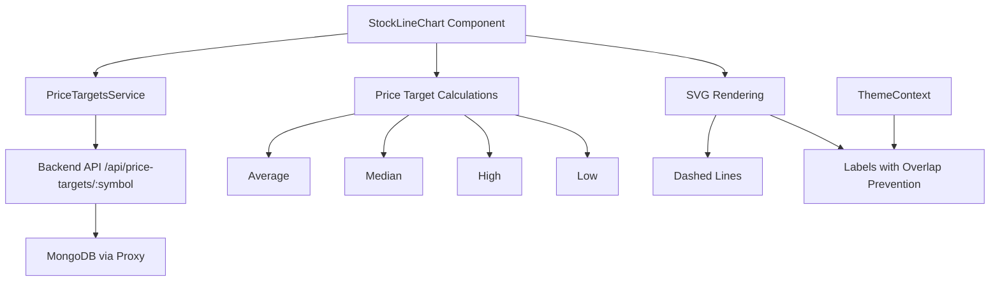

# Design Document: Analyst Price Targets

## Overview

This feature adds analyst price target visualization to the React Native StockLineChart component. The implementation mirrors the existing web app functionality, displaying dashed projection lines from the current stock price to analyst-provided price targets (high, median, average, and low).

The feature consists of three main parts:
1. **PriceTargetsService** - A service module that fetches and caches price target data from the backend API
2. **Price Target Calculations** - Logic to compute aggregate statistics (avg, median, high, low) from raw targets
3. **SVG Rendering** - Dashed lines and labels rendered in the chart's future section

## Architecture



## Components and Interfaces

### PriceTargetsService

A singleton service class that handles fetching price targets from the backend API.

```typescript
// src/services/PriceTargetsService.ts

export interface PriceTarget {
  _id: string;
  symbol: string;
  analyst_firm: string;
  analyst_name?: string;
  price_target: number;
  rating?: string;
  published_date: string;
  action?: string;
  previous_target?: number;
  updated_at?: string;
}

interface PriceTargetsServiceConfig {
  backendUrl: string;
  checkInterval: number; // milliseconds
}

class PriceTargetsService {
  private backendAvailable: boolean | null = null;
  private lastCheckTime: number = 0;
  private readonly CHECK_INTERVAL = 60000; // 60 seconds

  // Get backend URL based on environment
  private getBackendUrl(): string;
  
  // Fetch price targets for a symbol
  async fetchPriceTargets(symbol: string, limit?: number): Promise<PriceTarget[]>;
  
  // Deduplicate targets by analyst firm (keep most recent)
  deduplicateByAnalyst(targets: PriceTarget[]): PriceTarget[];
  
  // Reset availability check (for retry after backend deployment)
  resetAvailabilityCheck(): void;
}
```

### StockLineChart Props Extension

```typescript
interface StockLineChartProps {
  // ... existing props ...
  
  // New optional prop for price targets (can be passed from parent or fetched internally)
  priceTargets?: PriceTarget[];
  
  // Control whether to show price target lines (defaults to true when showUpcomingRange is true)
  showPriceTargets?: boolean;
}
```

### Price Target Calculation Utilities

```typescript
// src/utils/price-target-utils.ts

export interface PriceTargetStats {
  average: number;
  median: number;
  high: number;
  low: number;
  count: number;
}

// Calculate aggregate statistics from price targets
export function calculatePriceTargetStats(targets: PriceTarget[]): PriceTargetStats | null;

// Format price for display (2 decimals if < $10, whole number otherwise)
export function formatTargetPrice(price: number): string;

// Calculate Y position for a price target within chart bounds
export function calculateTargetY(
  price: number,
  minY: number,
  maxY: number,
  chartHeight: number,
  marginTop: number
): number;

// Adjust label positions to prevent overlap
export function adjustLabelPositions(
  labels: Array<{ y: number; height: number }>,
  minSpacing: number,
  chartHeight: number
): Array<{ y: number }>;
```

## Data Models

### PriceTarget (from MongoDB)

```typescript
interface PriceTarget {
  _id: string;                    // MongoDB ObjectId
  symbol: string;                 // Stock ticker (e.g., "AAPL")
  analyst_firm: string;           // Firm name (e.g., "Morgan Stanley")
  analyst_name?: string;          // Individual analyst name
  price_target: number;           // Target price in USD
  rating?: string;                // Rating (e.g., "Buy", "Hold", "Sell")
  published_date: string;         // ISO date string
  action?: string;                // Action (e.g., "Maintains", "Raises")
  previous_target?: number;       // Previous target price
  updated_at?: string;            // Last update timestamp
}
```

### PriceTargetLine (for rendering)

```typescript
interface PriceTargetLine {
  type: 'Avg' | 'Med' | 'High' | 'Low';
  price: number;
  color: string;
  strokeWidth: number;
  opacity: number;
  y: number;           // Calculated Y position
  labelY: number;      // Adjusted Y for label (after overlap prevention)
}
```

## Correctness Properties

*A property is a characteristic or behavior that should hold true across all valid executions of a system—essentially, a formal statement about what the system should do. Properties serve as the bridge between human-readable specifications and machine-verifiable correctness guarantees.*

### Property 1: Analyst Deduplication Preserves Most Recent

*For any* array of price targets containing multiple targets from the same analyst firm, deduplicating by analyst SHALL keep only the target with the most recent published_date for each firm, and the resulting array length SHALL be less than or equal to the input length.

**Validates: Requirements 1.2**

### Property 2: Statistical Calculations Correctness

*For any* non-empty array of valid price targets:
- The average SHALL equal the sum of all price_target values divided by the count
- The median SHALL be the middle value (or average of two middle values) when sorted
- The high SHALL equal the maximum price_target value
- The low SHALL equal the minimum price_target value

**Validates: Requirements 2.1, 2.2, 2.3, 2.4**

### Property 3: Price Formatting Consistency

*For any* price value:
- If price < 10, the formatted string SHALL contain exactly 2 decimal places
- If price >= 10, the formatted string SHALL contain no decimal places (whole number)

**Validates: Requirements 4.3, 4.4**

### Property 4: Label Overlap Prevention

*For any* set of 4 price target labels with initial Y positions, after adjustment:
- The vertical distance between any two adjacent labels SHALL be at least 20 pixels
- All labels SHALL remain within the chart boundaries (0 to chartHeight)

**Validates: Requirements 4.5**

### Property 5: Y Position Clamping

*For any* price target value and chart bounds (minY, maxY, chartHeight):
- The calculated Y position SHALL be >= 0
- The calculated Y position SHALL be <= chartHeight
- Prices within the visible range SHALL map proportionally to Y positions

**Validates: Requirements 3.7**

### Property 6: Line Styling Consistency

*For any* rendered price target line:
- The strokeDasharray SHALL be "4,4"
- The Average line SHALL have color #3b82f6 and strokeWidth 2
- The Median line SHALL have color #8b5cf6 and strokeWidth 1.5
- The High line SHALL have color #22c55e and strokeWidth 1.5
- The Low line SHALL have color #ef4444 and strokeWidth 1.5

**Validates: Requirements 3.2, 3.3, 3.4, 3.5, 3.6**

### Property 7: Backend Availability Caching

*For any* sequence of fetchPriceTargets calls within a 60-second window after a backend failure:
- Only the first call SHALL attempt to contact the backend
- Subsequent calls SHALL return empty arrays without network requests

**Validates: Requirements 1.4**

## Error Handling

### Network Errors

- **Backend Unavailable**: Return empty array, cache unavailability status for 60 seconds
- **Timeout**: Treat as backend unavailable, apply same caching logic
- **Invalid Response**: Log warning, return empty array

### Data Validation Errors

- **Missing price_target**: Filter out invalid targets before calculations
- **Invalid price_target (NaN, negative, zero)**: Filter out before calculations
- **Empty targets array**: Return null from calculatePriceTargetStats, don't render lines

### Rendering Edge Cases

- **All targets outside visible range**: Clamp Y positions to chart boundaries
- **Targets very close together**: Apply label overlap prevention algorithm
- **Single target**: Still calculate and display (avg = median = high = low)

## Testing Strategy

### Unit Tests

Unit tests will verify specific examples and edge cases:

1. **PriceTargetsService**
   - Successful fetch returns parsed targets
   - Network error returns empty array
   - Backend availability caching works correctly

2. **Price Target Calculations**
   - Empty array returns null
   - Single target returns same value for all stats
   - Known input produces expected output

3. **Label Positioning**
   - Labels at same Y get separated
   - Labels respect chart boundaries
   - Labels maintain minimum spacing

### Property-Based Tests

Property-based tests will use **fast-check** library to verify universal properties across many generated inputs.

Configuration:
- Minimum 100 iterations per property test
- Each test tagged with: **Feature: analyst-price-targets, Property {number}: {property_text}**

Tests to implement:
1. Deduplication preserves most recent per analyst
2. Statistical calculations are mathematically correct
3. Price formatting follows decimal rules
4. Label positions maintain minimum spacing
5. Y positions are clamped to bounds
6. Line styling matches specification

### Integration Tests

- Verify price targets render correctly in StockLineChart
- Verify mini mode does not fetch or display targets
- Verify theme switching updates label styles correctly
